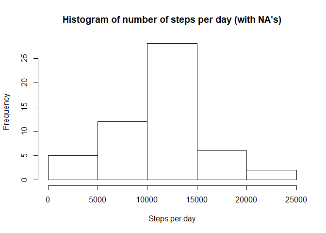
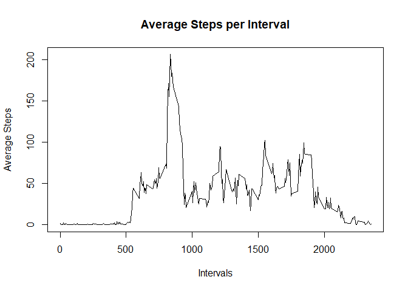
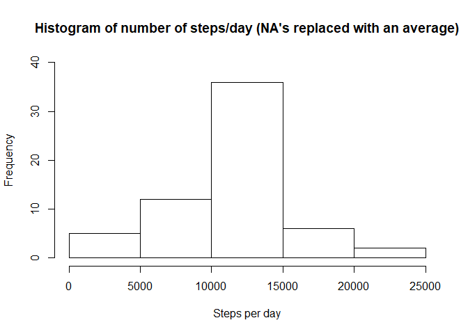
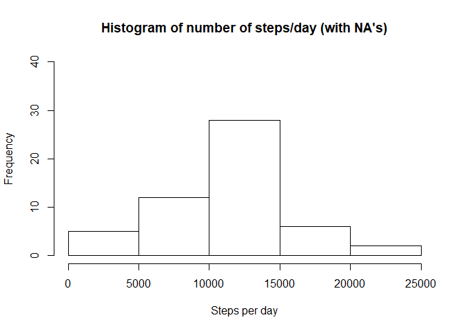
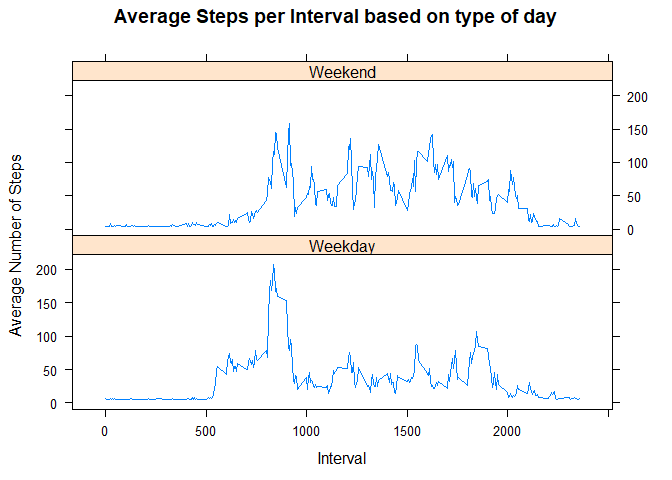

###Initialization

```r
library(plyr)
```

```
## Warning: package 'plyr' was built under R version 3.5.3
```

```r
library(lattice)
```

## Loading and preprocessing the data
Load the dataset and have a look at its structure, and data types:

```r
activity <- read.csv("activity.csv")
str(activity)
```

```
## 'data.frame':	17568 obs. of  3 variables:
##  $ steps   : int  NA NA NA NA NA NA NA NA NA NA ...
##  $ date    : Factor w/ 61 levels "2012-10-01","2012-10-02",..: 1 1 1 1 1 1 1 1 1 1 ...
##  $ interval: int  0 5 10 15 20 25 30 35 40 45 ...
```
Ok, so the "date" columns is currently a factor. Let's do something about that:

```r
activity[,2] <- as.Date(activity$date)
```
Let's have a look at the structure again:

```r
str(activity)
```

```
## 'data.frame':	17568 obs. of  3 variables:
##  $ steps   : int  NA NA NA NA NA NA NA NA NA NA ...
##  $ date    : Date, format: "2012-10-01" "2012-10-01" ...
##  $ interval: int  0 5 10 15 20 25 30 35 40 45 ...
```


## What is mean total number of steps taken per day?
Sweet, now that the dataset is in order, let's have a look at the characteristics of the data in terms of mean and median:

```r
steps <- with(activity,tapply(steps,date,sum, na.rm=T))
steps_mean <- round(mean(steps),1)
steps_median <- median(steps)
print(paste0("Mean steps per day is: ", steps_mean, ", and median: ", steps_median))
```

```
## [1] "Mean steps per day is: 9354.2, and median: 10395"
```
I see that this person has a better score than me, as I'm mostly just sitting on my arse in my office. Well well, always room for improvement.
  
Let's do a histogram:

```r
steps_withNAs <- with(activity,tapply(steps,date,sum, na.rm=F))
hist(steps_withNAs, xlab = "Steps per day", main = "Histogram of number of steps per day (with NA's)")
```

<!-- -->


## What is the average daily activity pattern?
A time series plot over average number of steps (x-axis) take per interval accross all days (y-axis):

```r
mean_steps_per_interval <-with(activity,tapply(steps,interval,mean,na.rm=T))
intervals<-unique(activity$interval)
df_avgsteps_interval <-data.frame(cbind(mean_steps_per_interval,intervals))
plot(df_avgsteps_interval$intervals,
    df_avgsteps_interval$mean_steps_per_interval,
    type = "l",
    xlab = "Intervals",
    ylab = "Average Steps",
    main = "Average Steps per Interval")
```

<!-- -->

Which 5-minute interval, on average across all the days in the dataset, contains the maximum number of steps?

```r
index<-which.max(df_avgsteps_interval$mean_steps_per_interval)
print(df_avgsteps_interval[index,2])
```

```
## [1] 835
```

As we saw earlier, the "steps" column has a lot of NA's. How many?

```r
sum(is.na(activity$steps))
```

```
## [1] 2304
```


## Imputing missing values
Next task is to replace the NA's in steps to later see the consequences of not taking these into account. First, let's create a copy of the activity data set where the NA's are replaced with the average number of steps per day.

```r
index<-which(is.na(activity$steps))
l<-length(index)
steps_avg<-with(activity,tapply(steps,date,mean,na.rm=T))
na<-mean(steps_avg,na.rm = T)

##Create a copy of activity where NA's are replaced
activity_noNA <- activity
for (i in 1:l) {
        activity_noNA[index[i],1]<-na
}
```
  
Let's compare the old and new version of the activity dataset:

```r
head(activity)
```

```
##   steps       date interval
## 1    NA 2012-10-01        0
## 2    NA 2012-10-01        5
## 3    NA 2012-10-01       10
## 4    NA 2012-10-01       15
## 5    NA 2012-10-01       20
## 6    NA 2012-10-01       25
```

```r
head(activity_noNA)
```

```
##     steps       date interval
## 1 37.3826 2012-10-01        0
## 2 37.3826 2012-10-01        5
## 3 37.3826 2012-10-01       10
## 4 37.3826 2012-10-01       15
## 5 37.3826 2012-10-01       20
## 6 37.3826 2012-10-01       25
```
  
And then move on to compare histograms over first and new version:

```r
steps_noNAs <- with(activity_noNA,tapply(steps,date,sum))
hist(steps_noNAs, ylim = c(0,40), xlab = "Steps per day", main = "Histogram of number of steps/day (NA's replaced with an average)")
```

<!-- -->

```r
steps_withNAs <- with(activity,tapply(steps,date,sum, na.rm=F))
hist(steps_withNAs,ylim = c(0,40), xlab = "Steps per day", main = "Histogram of number of steps/day (with NA's)")
```

<!-- -->
  
Whatabout changes in mean and median between the two datasets?

```r
steps_noNAs_mean <- round(mean(steps_noNAs),1)
steps_noNAs_median <- round(median(steps_noNAs),1)
print(paste0("Mean steps when NA's still there: ", steps_mean, ", and without NA's: ", steps_noNAs_mean))
```

```
## [1] "Mean steps when NA's still there: 9354.2, and without NA's: 10766.2"
```

```r
print(paste0("Median steps when NA's still there: ", steps_median, ", and without NA's: ", steps_noNAs_median))
```

```
## [1] "Median steps when NA's still there: 10395, and without NA's: 10766.2"
```


## Are there differences in activity patterns between weekdays and weekends?
On a different note, is there a difference in pattern between weekdays and weekends?
(using the dataset where NA's are replaced with an average)
  
Let's first categorize each day as a weekday/weekend, and add that category as a factor:

```r
activity_noNA$DayCategory <- ifelse(weekdays(activity_noNA$date) %in% c("Saturday", "Sunday"), "Weekend", "Weekday")
```
  
Now, let's look at the difference in pattern:

```r
## Summarize data by interval and type of day
df_avgsteps_interval_2 <- ddply(activity_noNA, .(interval, DayCategory), summarize, Avg = mean(steps))
head(df_avgsteps_interval_2)
```

```
##   interval DayCategory      Avg
## 1        0     Weekday 7.006569
## 2        0     Weekend 4.672825
## 3        5     Weekday 5.384347
## 4        5     Weekend 4.672825
## 5       10     Weekday 5.139902
## 6       10     Weekend 4.672825
```

```r
##Plot data in a panel plot
xyplot(Avg~interval|DayCategory, 
       data=df_avgsteps_interval_2, 
       type="l", 
       layout = c(1,2),
       main="Average Steps per Interval based on type of day",
       ylab="Average Number of Steps",
       xlab="Interval")
```

<!-- -->
